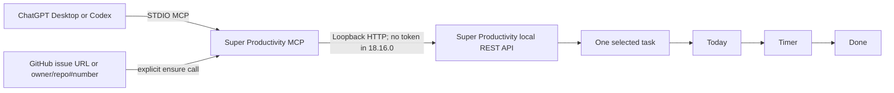
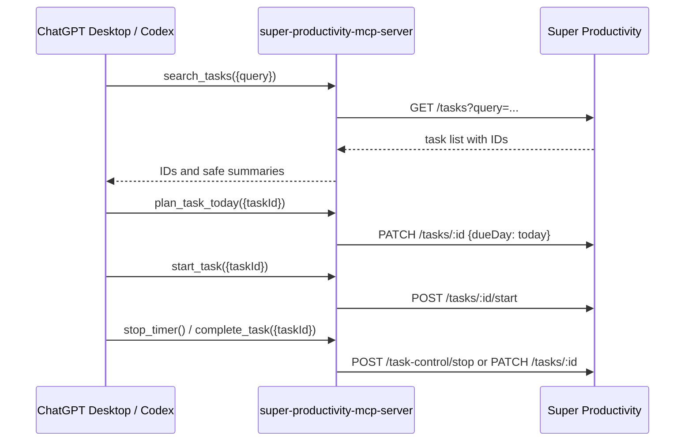

# Super Productivity MCP

[](https://github.com/Amorem/super-productivity-mcp/actions/workflows/ci.yml)
[](LICENSE)
[](https://nodejs.org/)
[](https://www.npmjs.com/package/super-productivity-mcp-server)


An explicit, local [Model Context Protocol](https://modelcontextprotocol.io/) server for
[Super Productivity](https://super-productivity.com/). It connects ChatGPT Desktop or Codex to
Super Productivity's official local REST API over STDIO.

The core promise is deliberately small:

> Select one task explicitly, put it in Today, start or stop its timer, and complete it.

Nothing is imported or scheduled implicitly. GitHub issue association is opt-in per tool call.

## Quick start

The complete first-run path takes a few minutes:

1. Install the **Super Productivity desktop app 18.x or newer**. The web and mobile apps do not
   expose this local API. If **Enable local REST API** is missing, update the desktop app from the
   [official releases](https://github.com/super-productivity/super-productivity/releases/latest).
2. In Super Productivity, open **Settings → Misc Settings** and enable **Enable local REST API**.
   With the released 18.16.0 desktop app, no token is displayed and no token is required.
3. Add this server to ChatGPT Desktop or Codex using the setup below. Leave `SP_API_TOKEN` unset for
   Super Productivity 18.16.0. If a future build displays an Access Token, it can be supplied through
   that optional variable; never paste it into a chat or commit it to this repository.
4. Restart or reload the MCP host if it was already open, then ask it:

   ```text
   Check the connection to Super Productivity with check_connection.
   ```

5. Once the connection succeeds, use `search_tasks` to find one task and pass its returned
   `taskId` explicitly to `plan_task_today`, `start_task`, `stop_timer`, or `complete_task`.

Optional local liveness check (it does not require the token):

```bash
curl --noproxy 127.0.0.1 http://127.0.0.1:3876/health
```

The expected response contains `"server":"up"` and `"rendererReady":true`.

## What it does

| Tool                          | Purpose                                     |         Changes state |
| ----------------------------- | ------------------------------------------- | --------------------: |
| `health` / `check_connection` | Check the local API and renderer            |                    No |
| `search_tasks`                | Find tasks and return stable IDs            |                    No |
| `list_today`                  | List tasks already planned for Today        |                    No |
| `plan_task_today`             | Plan exactly one supplied task ID for Today |                   Yes |
| `start_task`                  | Start exactly one supplied task ID          |                   Yes |
| `stop_timer`                  | Stop the current timer                      |                   Yes |
| `complete_task`               | Complete exactly one supplied task ID       |                   Yes |
| `get_current_task`            | Read the currently tracked task             |                    No |
| `ensure_github_issue_task`    | Reuse or create one task for a GitHub issue | Yes, only when called |

The server intentionally does not create GitHub issues. Use the GitHub integration or connector for
that, then call `ensure_github_issue_task` only when you explicitly want the issue in Super
Productivity.

## The workflow



Typical conversation:

```text
Search Super Productivity for "Add the export filter".
Plan task <returned taskId> for Today.
Start task <same taskId>.
Stop the timer.
Complete task <same taskId>.
```

The server instructions tell an MCP client to search first and pass the exact returned `taskId` to
every state-changing operation. There is no bulk-selection fallback.

## Requirements

- Super Productivity desktop 18.x or newer with the local REST API enabled.
- Node.js 20 or newer.

In Super Productivity, enable **Settings → Misc Settings → Enable local REST API**. The official API
listens on `http://127.0.0.1:3876` by default and exposes an unauthenticated `/health` endpoint. The
released 18.16.0 desktop API is also unauthenticated for task endpoints, so no token is needed for
the normal setup. This server sends a Bearer token only when the optional `SP_API_TOKEN` is set, to
remain compatible with future authenticated builds.

Read the [official Super Productivity local REST API documentation](https://github.com/super-productivity/super-productivity/blob/master/docs/wiki/3.01-API.md)
before changing the API URL or exposing a proxy. The upstream API is release-sensitive: this
package's no-token default matches the [18.16.0 desktop release](https://github.com/super-productivity/super-productivity/releases/tag/v18.16.0),
whose [released API handler](https://github.com/super-productivity/super-productivity/blob/v18.16.0/electron/local-rest-api.ts)
does not authenticate task requests.

## Install

From the public npm registry:

```bash
npx -y super-productivity-mcp-server
```

End users do not need an npm account or an npm login to install the public package.

For a local checkout:

```bash
pnpm install
pnpm build
node /absolute/path/to/super-productivity-mcp/dist/index.js
```

### Package and releases

The public package is [`super-productivity-mcp-server`](https://www.npmjs.com/package/super-productivity-mcp-server).
The GitHub release workflow publishes new versions when the repository has an `NPM_TOKEN` Actions
secret. That maintainer-only credential is not needed by people installing or using the server.

The server reads configuration from environment variables:

| Variable                    | Default                 | Notes                                                               |
| --------------------------- | ----------------------- | ------------------------------------------------------------------- |
| `SP_API_TOKEN`              | —                       | Optional Bearer token for an authenticated Super Productivity build |
| `SP_API_URL`                | `http://127.0.0.1:3876` | HTTP(S) URL; loopback is enforced by default                        |
| `SP_API_TIMEOUT_MS`         | `15000`                 | Integer from 1000 to 60000                                          |
| `SP_ALLOW_NON_LOOPBACK_URL` | `false`                 | Use only for a trusted local proxy                                  |
| `SP_LOG_LEVEL`              | `warn`                  | `error`, `warn`, `info`, or `debug`                                 |

See [.env.example](.env.example) for a copyable template.

## ChatGPT Desktop

The current ChatGPT desktop MCP flow is:

1. Open **Settings → MCP servers → Add server**.
2. Choose **STDIO**.
3. Set the command to `npx` and arguments to `-y`, `super-productivity-mcp-server`.
4. Leave the server environment empty for Super Productivity 18.16.0. If your Super Productivity
   build displays an Access Token, add it as `SP_API_TOKEN`.
5. Save and restart ChatGPT Desktop if it asks you to.

If the **MCP servers** menu or local **STDIO** option is unavailable, update ChatGPT Desktop to a
version that supports local STDIO MCP servers. The npm package is public, so no npm login is needed.

For a local build, use `node` with the absolute path to `dist/index.js`. See
[examples/chatgpt-desktop.md](examples/chatgpt-desktop.md).

## Codex

Codex can load a local STDIO server from `~/.codex/config.toml`:

```toml
[mcp_servers.super_productivity]
command = "npx"
args = ["-y", "super-productivity-mcp-server"]

[mcp_servers.super_productivity.env]
SP_API_URL = "http://127.0.0.1:3876"
SP_LOG_LEVEL = "warn"

# Optional: only for a Super Productivity build that exposes an Access Token.
# env_vars = ["SP_API_TOKEN"]
```

Start Codex and use `/mcp` to check the connection:

```bash
codex
```

For a build that displays an Access Token, export it before starting Codex:

```bash
export SP_API_TOKEN='paste-your-local-access-token-here'
codex
```

If Codex was already running when the token was exported, restart it so the MCP process inherits the
environment. Keep the token out of `config.toml` when possible.

For a local checkout, replace the command and arguments with:

```toml
[mcp_servers.super_productivity]
command = "node"
args = ["/absolute/path/to/super-productivity-mcp/dist/index.js"]
```

See [examples/codex-config.toml](examples/codex-config.toml). The
[official OpenAI MCP setup documentation](https://learn.chatgpt.com/docs/extend/mcp) covers the
current desktop and Codex configuration surfaces.

## Troubleshooting

### I cannot find “Enable local REST API”

Confirm that you are using the **desktop** app, not the web or mobile app, and that its version is
18.x or newer. Quit and update it from the [official Super Productivity releases](https://github.com/super-productivity/super-productivity/releases/latest),
then return to **Settings → Misc Settings**. This setting is not present in older desktop builds.

### I can enable the API, but I do not see a token

That is expected with the released Super Productivity 18.16.0 desktop app. Its local API is bound
to loopback and does not require a token, so leave `SP_API_TOKEN` unset. Do not use an npm or GitHub
token in its place. A future Super Productivity build may expose an Access Token; use it only when
the app itself displays one.

### `ECONNREFUSED 127.0.0.1:3876`

Super Productivity is closed, the local API is disabled, or the renderer has not finished starting.
Keep the desktop app open, enable the API, wait a few seconds, and retry `check_connection`.

### `401 Unauthorized`

This only applies when using a Super Productivity build that requires a Bearer token. Copy the
current Access Token from that app, set it as `SP_API_TOKEN`, and restart the MCP host. Do not use
the npm publication token here.

### The server does not appear in the MCP client

Check that Node.js 20 or newer is installed, that the command is exactly `npx` with arguments
`-y super-productivity-mcp-server`, and restart the MCP host. The server speaks MCP over STDIO, so
normal diagnostics go to stderr rather than appearing as a regular terminal application.

### `check_connection` succeeds but no tasks are returned

Use `search_tasks` with a distinctive part of an existing task title. State-changing tools require
the exact `taskId` returned by that search; the server never guesses a task or bulk-imports issues.

## GitHub issue association

Call the tool explicitly with either form:

```text
ensure_github_issue_task({ issue: "Amorem/my-repo#123" })
ensure_github_issue_task({ issue: "https://github.com/Amorem/my-repo/issues/123", planToday: true })
```

The server searches active, archived, and completed local tasks. It reuses a task containing its
stable marker or exact issue URL. If no safe match exists, it creates one task with a marker and
returns its ID. Repeating the same call is idempotent. `planToday` defaults to `false` and must be
set explicitly.

The current Super Productivity local REST API does not expose writable GitHub provider fields in
its task PATCH allowlist. For that reason, tasks created by this server use a private, visible-in-
notes marker; native GitHub-linked tasks are recognized when the local API exposes an unambiguous
GitHub issue number. If two native tasks could match, the server returns an ambiguity error instead
of choosing silently. No GitHub token or GitHub network request is required by this server.

## Security model

- STDIO stdout is reserved for MCP protocol messages; diagnostics go to stderr.
- `SP_API_TOKEN` is optional; when supplied, it is never printed and is redacted in error/log paths.
- The configured API URL must be loopback unless `SP_ALLOW_NON_LOOPBACK_URL=true` is explicitly set.
- Super Productivity 18.16.0's local API has no application-level authentication. Keep the API on
  loopback and remember that local applications running as the same user can read and modify tasks.
- If a future build provides a local API token, protect the environment and configuration that can
  access it.
- The server does not import all GitHub issues, poll GitHub, or perform background actions.
- All task mutations require an exact `taskId`, except the explicit, idempotent GitHub association
  tool which creates at most one marked task.

## Architecture



Implementation boundaries are intentionally narrow:

- `src/sp-client.ts` is the typed, timeout-bound REST client.
- `src/server.ts` contains MCP schemas and explicit tool behavior.
- `src/github.ts` parses and deduplicates issue references without GitHub network access.
- `src/config.ts`, `src/errors.ts`, and `src/logger.ts` enforce safe configuration and diagnostics.

## Development

```bash
pnpm install
pnpm verify
```

`pnpm verify` runs lint, formatting checks, strict TypeScript typechecking, unit/integration tests,
and the production build. The test suite uses mocked REST responses and the official MCP SDK's
in-memory transport; it never contacts Super Productivity or GitHub.

See [CONTRIBUTING.md](CONTRIBUTING.md) for the contribution workflow and
[SECURITY.md](SECURITY.md) for vulnerability reports.

## Roadmap

- Add a safe provider-aware lookup when Super Productivity exposes issue-provider configuration via
  the local API.
- Add optional GitHub metadata enrichment behind an explicit, separately configured connector.
- Add a small interactive setup command that validates the local API without storing the token.
- Add compatibility fixtures for each supported Super Productivity API revision.

## License

MIT. See [LICENSE](LICENSE).
