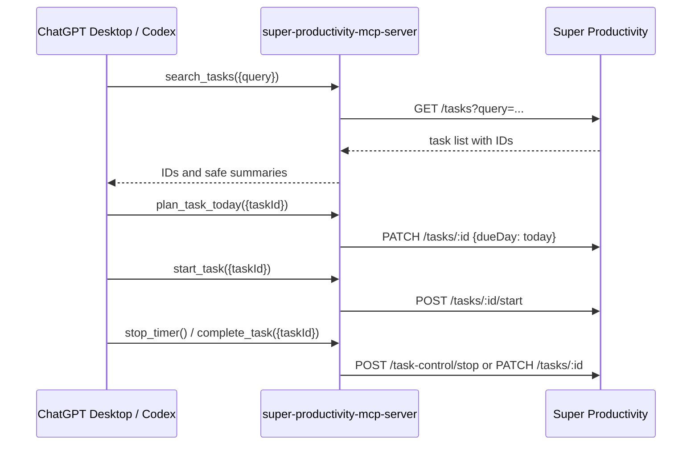

# Super Productivity MCP

[](https://github.com/Amorem/super-productivity-mcp/actions/workflows/ci.yml)
[](LICENSE)
[](https://nodejs.org/)


An explicit, local [Model Context Protocol](https://modelcontextprotocol.io/) server for
[Super Productivity](https://super-productivity.com/). It connects ChatGPT Desktop or Codex to
Super Productivity's official local REST API over STDIO.

The core promise is deliberately small:

> Select one task explicitly, put it in Today, start or stop its timer, and complete it.

Nothing is imported or scheduled implicitly. GitHub issue association is opt-in per tool call.

## What it does

| Tool                          | Purpose                                     |         Changes state |
| ----------------------------- | ------------------------------------------- | --------------------: |
| `health` / `check_connection` | Check the local API and renderer            |                    No |
| `search_tasks`                | Find tasks and return stable IDs            |                    No |
| `list_today`                  | List tasks already planned for Today        |                    No |
| `plan_task_today`             | Plan exactly one supplied task ID for Today |                   Yes |
| `start_task`                  | Start exactly one supplied task ID          |                   Yes |
| `stop_timer`                  | Stop the current timer                      |                   Yes |
| `complete_task`               | Complete exactly one supplied task ID       |                   Yes |
| `get_current_task`            | Read the currently tracked task             |                    No |
| `ensure_github_issue_task`    | Reuse or create one task for a GitHub issue | Yes, only when called |

The server intentionally does not create GitHub issues. Use the GitHub integration or connector for
that, then call `ensure_github_issue_task` only when you explicitly want the issue in Super
Productivity.

## The workflow


Typical conversation:

```text
Search Super Productivity for "Add the export filter".
Plan task <returned taskId> for Today.
Start task <same taskId>.
Stop the timer.
Complete task <same taskId>.
```

The server instructions tell an MCP client to search first and pass the exact returned `taskId` to
every state-changing operation. There is no bulk-selection fallback.

## Requirements

- Super Productivity desktop with the local REST API enabled.
- Node.js 20 or newer.
- An access token copied from Super Productivity's settings.

In Super Productivity, enable **Settings → Misc → Enable local REST API** and copy the **Access
Token**. The official API currently listens on `http://127.0.0.1:3876` by default, exposes an
unauthenticated `/health` endpoint, and requires a Bearer token for the other endpoints.

Read the [official Super Productivity local REST API documentation](https://github.com/super-productivity/super-productivity/blob/master/docs/wiki/3.01-API.md)
before changing the API URL or exposing a proxy.

## Install

Once published:

```bash
npx -y super-productivity-mcp-server
```

For a local checkout:

```bash
pnpm install
pnpm build
node /absolute/path/to/super-productivity-mcp/dist/index.js
```

The server reads configuration from environment variables:

| Variable                    | Default                 | Notes                                                        |
| --------------------------- | ----------------------- | ------------------------------------------------------------ |
| `SP_API_TOKEN`              | —                       | Required for task operations; keep it outside source control |
| `SP_API_URL`                | `http://127.0.0.1:3876` | HTTP(S) URL; loopback is enforced by default                 |
| `SP_API_TIMEOUT_MS`         | `15000`                 | Integer from 1000 to 60000                                   |
| `SP_ALLOW_NON_LOOPBACK_URL` | `false`                 | Use only for a trusted local proxy                           |
| `SP_LOG_LEVEL`              | `warn`                  | `error`, `warn`, `info`, or `debug`                          |

See [.env.example](.env.example) for a copyable template.

## ChatGPT Desktop

The current ChatGPT desktop MCP flow is:

1. Open **Settings → MCP servers → Add server**.
2. Choose **STDIO**.
3. Set the command to `npx` and arguments to `-y`, `super-productivity-mcp-server`.
4. Provide `SP_API_TOKEN` in the server environment.
5. Save and restart the desktop app if it asks you to.

For a local build, use `node` with the absolute path to `dist/index.js`. See
[examples/chatgpt-desktop.md](examples/chatgpt-desktop.md).

## Codex

Codex can load a local STDIO server from `~/.codex/config.toml`:

```toml
[mcp_servers.super_productivity]
command = "npx"
args = ["-y", "super-productivity-mcp-server"]
env_vars = ["SP_API_TOKEN"]

[mcp_servers.super_productivity.env]
SP_API_URL = "http://127.0.0.1:3876"
SP_LOG_LEVEL = "warn"
```

Export the token in the environment that launches Codex, then use `/mcp` to check the connection:

```bash
export SP_API_TOKEN='paste-your-local-access-token-here'
codex
```

For a local checkout, replace the command and arguments with:

```toml
[mcp_servers.super_productivity]
command = "node"
args = ["/absolute/path/to/super-productivity-mcp/dist/index.js"]
env_vars = ["SP_API_TOKEN"]
```

See [examples/codex-config.toml](examples/codex-config.toml). The
[official OpenAI MCP setup documentation](https://learn.chatgpt.com/docs/extend/mcp) covers the
current desktop and Codex configuration surfaces.

## GitHub issue association

Call the tool explicitly with either form:

```text
ensure_github_issue_task({ issue: "Amorem/my-repo#123" })
ensure_github_issue_task({ issue: "https://github.com/Amorem/my-repo/issues/123", planToday: true })
```

The server searches active, archived, and completed local tasks. It reuses a task containing its
stable marker or exact issue URL. If no safe match exists, it creates one task with a marker and
returns its ID. Repeating the same call is idempotent. `planToday` defaults to `false` and must be
set explicitly.

The current Super Productivity local REST API does not expose writable GitHub provider fields in
its task PATCH allowlist. For that reason, tasks created by this server use a private, visible-in-
notes marker; native GitHub-linked tasks are recognized when the local API exposes an unambiguous
GitHub issue number. If two native tasks could match, the server returns an ambiguity error instead
of choosing silently. No GitHub token or GitHub network request is required by this server.

## Security model

- STDIO stdout is reserved for MCP protocol messages; diagnostics go to stderr.
- Tokens are read from `SP_API_TOKEN`, never printed, and redacted in error/log paths.
- The configured API URL must be loopback unless `SP_ALLOW_NON_LOOPBACK_URL=true` is explicitly set.
- The local API token is a capability for processes running as the same user. Protect the environment
  and Codex configuration that can access it.
- The server does not import all GitHub issues, poll GitHub, or perform background actions.
- All task mutations require an exact `taskId`, except the explicit, idempotent GitHub association
  tool which creates at most one marked task.

## Architecture



Implementation boundaries are intentionally narrow:

- `src/sp-client.ts` is the typed, timeout-bound REST client.
- `src/server.ts` contains MCP schemas and explicit tool behavior.
- `src/github.ts` parses and deduplicates issue references without GitHub network access.
- `src/config.ts`, `src/errors.ts`, and `src/logger.ts` enforce safe configuration and diagnostics.

## Development

```bash
pnpm install
pnpm verify
```

`pnpm verify` runs lint, formatting checks, strict TypeScript typechecking, unit/integration tests,
and the production build. The test suite uses mocked REST responses and the official MCP SDK's
in-memory transport; it never contacts Super Productivity or GitHub.

See [CONTRIBUTING.md](CONTRIBUTING.md) for the contribution workflow and
[SECURITY.md](SECURITY.md) for vulnerability reports.

## Roadmap

- Add a safe provider-aware lookup when Super Productivity exposes issue-provider configuration via
  the local API.
- Add optional GitHub metadata enrichment behind an explicit, separately configured connector.
- Add a small interactive setup command that validates the local API without storing the token.
- Add compatibility fixtures for each supported Super Productivity API revision.

## License

MIT. See [LICENSE](LICENSE).
