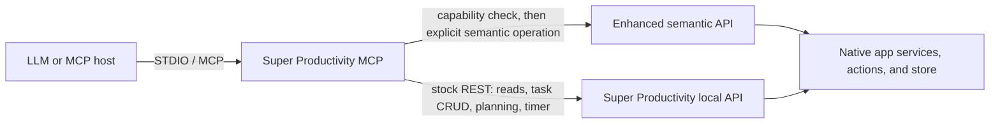

# Architecture

The MCP package and the Super Productivity app patch are separate deliverables. The MCP can use the stock local REST API by itself. The enhanced semantic API is an optional app-side extension for operations that the stock routes do not safely support.

## Request flow

The MCP host invokes an explicitly named tool with validated arguments. The MCP server applies bounds and resolves exact task, project, or tag identifiers. `src/sp-client.ts` sends ordinary operations to the stock local REST API. For enhanced operations, it first reads the advertised protocol version and feature list, then sends one supported operation to the compatible app build. A stock app that does not advertise the requested feature returns a clear unavailable result; the MCP remains usable for stock-supported operations.

The extension currently uses the loopback route prefix `/bridge/` for compatibility with the implementation. It is a versioned enhanced semantic API, not a generic bridge or RPC surface. The capability registry is explicit. Routes validate a small input shape and call named app feature methods that use the corresponding native service/action. There is no arbitrary NgRx action, state setter, or service invocation endpoint.

## Write safety

Task PATCH requests contain only fields supplied by the caller. The MCP does not round-trip a full task snapshot because task schemas can contain fields the caller did not intend to change. Relational operations such as hierarchy and ordered moves go through native app operations so redundant parent/child or context/order state remains consistent.

After writes, the server reads persisted state back and checks the requested values and selected unrelated metadata. For a multi-task update, each item is applied in order; the server stops after an outcome that cannot be confirmed so later writes do not compound uncertainty. Destructive operations require an exact ID and explain their scope. Project and tag deletion are restricted to empty objects.

## Capability boundary

Stock mode covers task reads and context, creation, supported sparse task updates, project/tag lookup and membership, planning, timers, lifecycle, queues, bulk updates, and explicit local GitHub issue association. Enhanced mode currently adds priority, hierarchy, order, historical time, guarded project/tag administration, and safe attachment metadata operations.

Recurrence configuration writes remain unsupported because recurrence effects coordinate occurrence creation, schedule cursors, exceptions, completion, and templates. Local file/image attachment writes and binary transfer are unsupported because attachment references may expose local paths or cause renderer fetches. See `FEATURES.md` for source and verification status.

## Runtime boundary

The MCP server uses STDIO and makes no inbound HTTP listener. Both app API URLs are restricted to loopback by default. The app’s `/health` endpoint is unauthenticated; protected routes require the token when the running app build enables token authentication. Optional tokens are sent only in the authorization header and redacted from diagnostics. The MCP does not contact GitHub; its issue tool parses the supplied reference and works only with local tasks.
