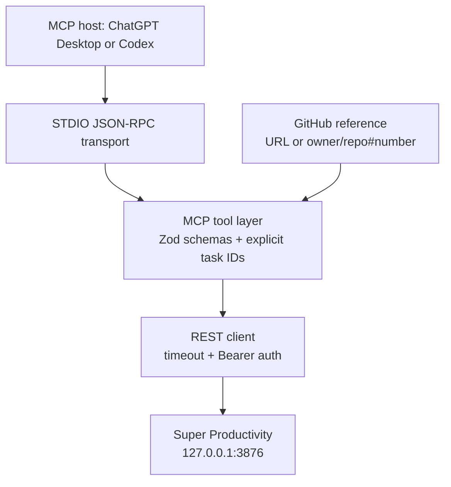
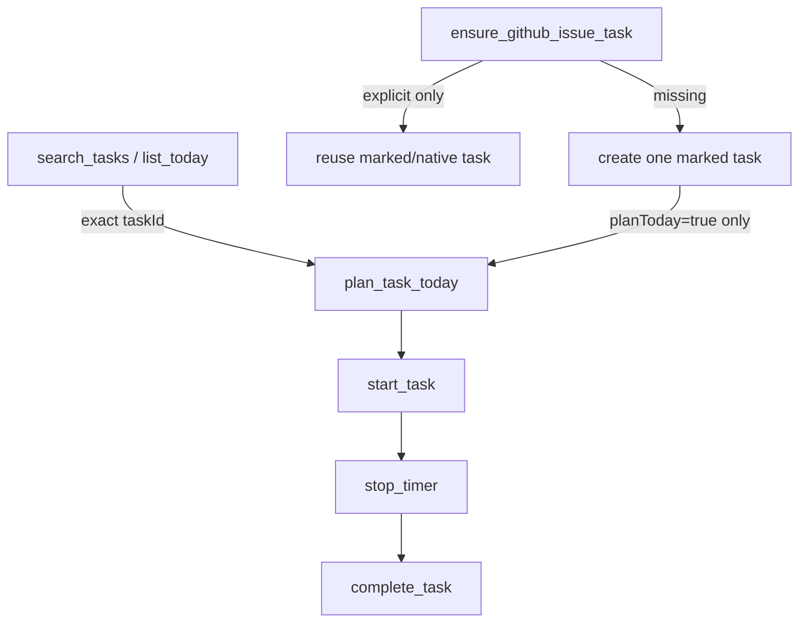

# Architecture

The server has no background worker, database, GitHub network client, or HTTP listener. Its only
state is the local Super Productivity state it reads and updates in response to an MCP tool call.

## State-changing boundary

